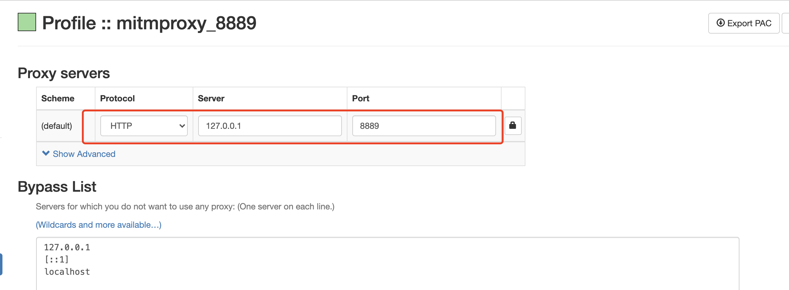
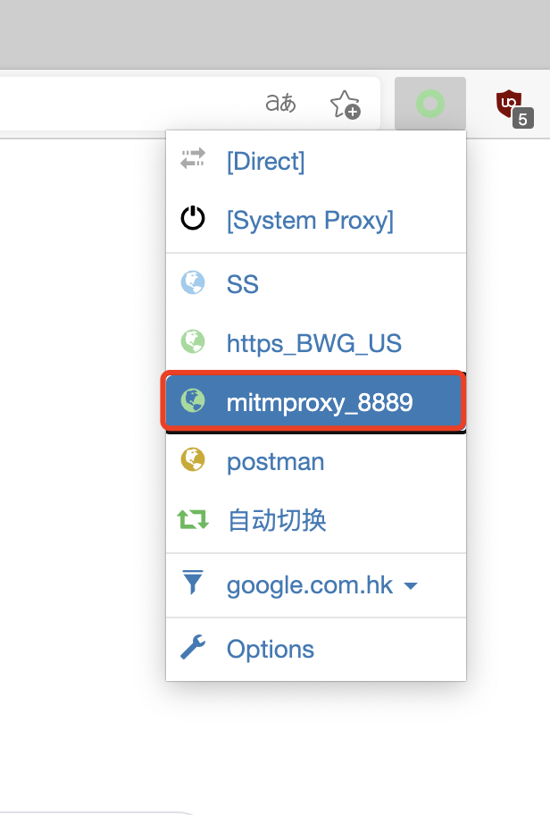
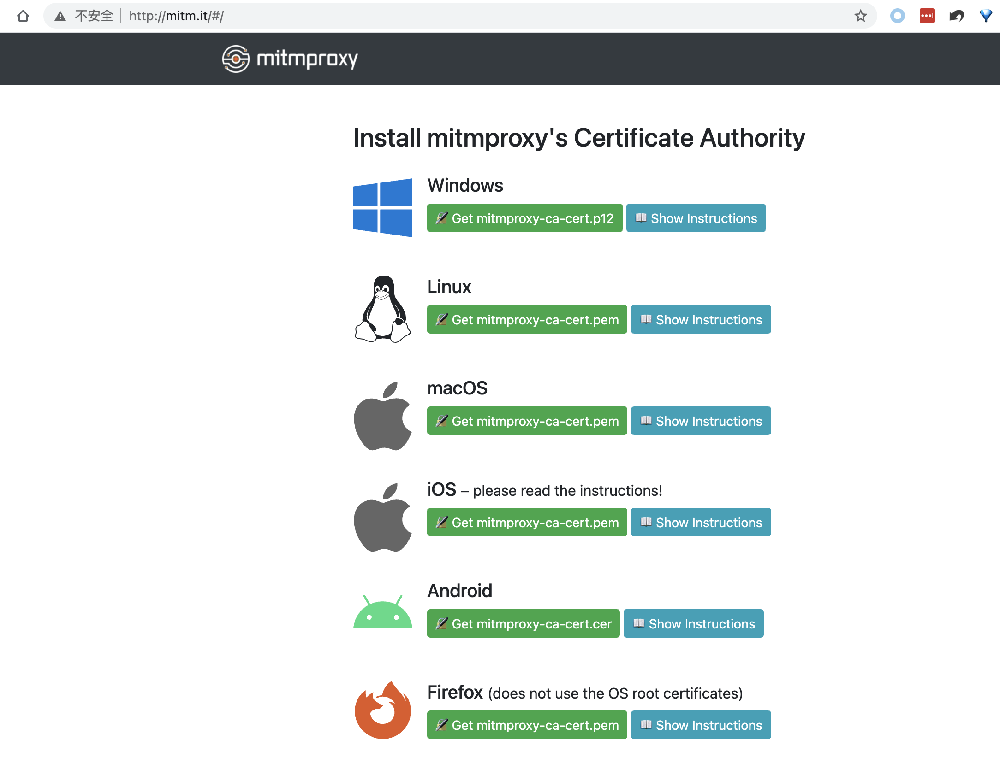

# Record http api data via mitmproxy

## 1.Introduction for mitmproxy

mitmproxy is a set of tools that provide an interactive, SSL/TLS-capable intercepting proxy for HTTP/1, HTTP/2, and WebSockets.  
more details: [https://mitmproxy.org/](website)

## 2.Installation
First, you need to install python3, and the version needs to be at least 3.7.  
For windows and MacOS, run the follow command to install mitmproxy.
```
pip3 install mitmproxy
```
Once installed, verify its success by running the following command:
```
mitmdump --version
```
You should see an output similar to this:
```
Mitmproxy: 10.0.0
Python:    3.11.2
OpenSSL:   OpenSSL 3.0.8 7 Feb 2023
Platform:  Windows-10-10.0.25926-SP0
```

## 3.Run mitmdump
```
mitmdump -p 8889
```

## 4.Configuring Browser Proxy
Perhaps the easiest method is to install the [“SwitchyOmega”](https://chrome.google.com/webstore/detail/proxy-switchyomega/padekgcemlokbadohgkifijomclgjgif) Proxy extension.
Open SwitchyOmega’s options page and create a new proxy profile like this, the port number should be the same as in the previous start command.  

To complete the process, click on the "SwitchyOmega" icon and choose your newly configured proxy.  


## 5.Install mitmproxy's Certificate
Start mitmproxy and configure brower with the correct proxy settings, now visit [mitm.it](http://mitm.it/), You should see something like this:  
  
Click on the appropriate icon and follow the setup instructions for your platform.

## 6.Capture & record requests
1. Please edit the [record_http_api.py] file to configure the listening port and specify the filters for capturing data, such as domains/URLs, request methods, response status codes, etc. After making these changes, run your script using the following command:
   ```
   python3 record_http_api.py
   ```
2. In the Chrome browser, when you select your configured proxy and browse the web, the involved APIs will be automatically recorded to a *.csv file in the specified directory.
